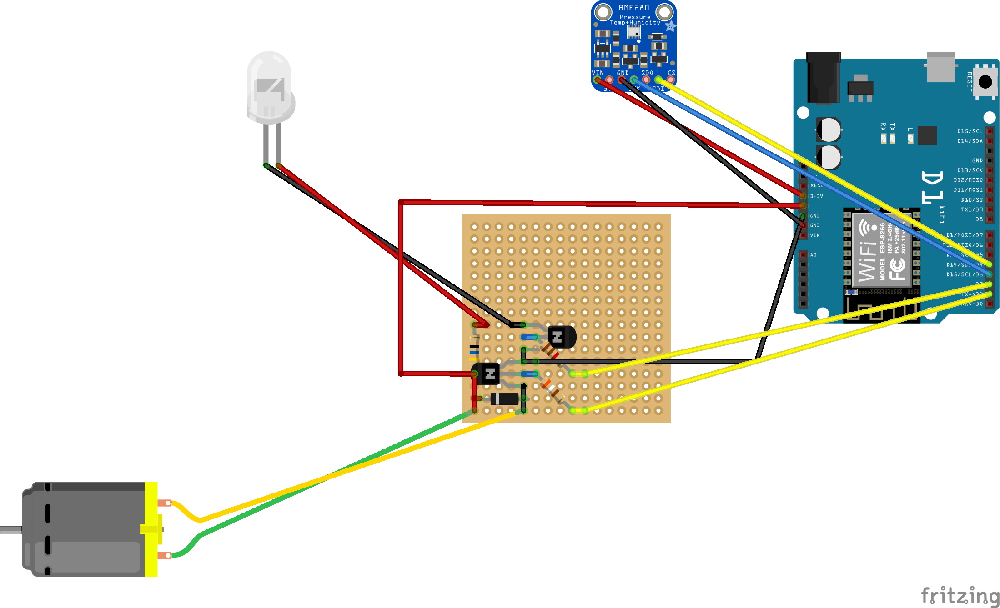
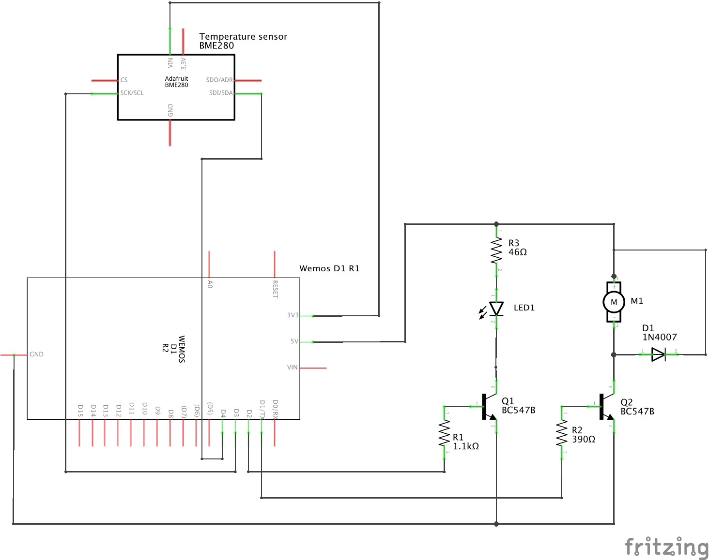

# revolving-blue-light-esp8266
Wiring up an old battery powered revolving blue light with an ESP8266 based Wemos D1 R2. Plus added a BME280 temperature sensor as extra bonus.

## Breadboard View

## Circuit Diagram
