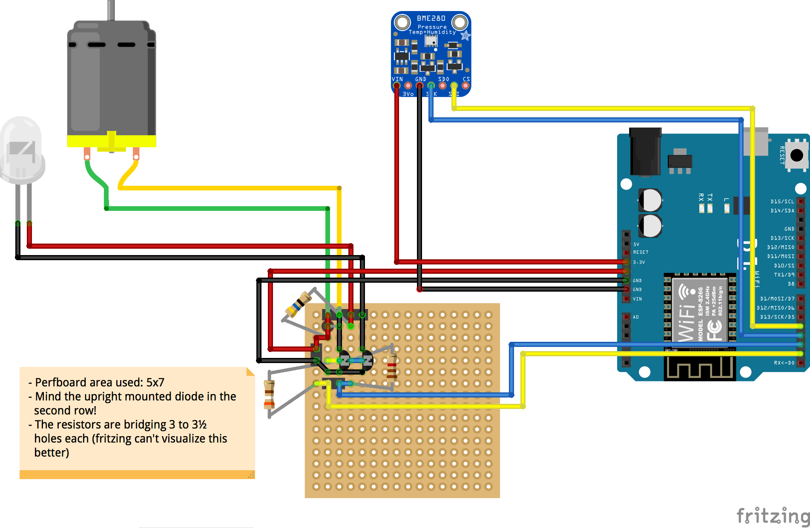
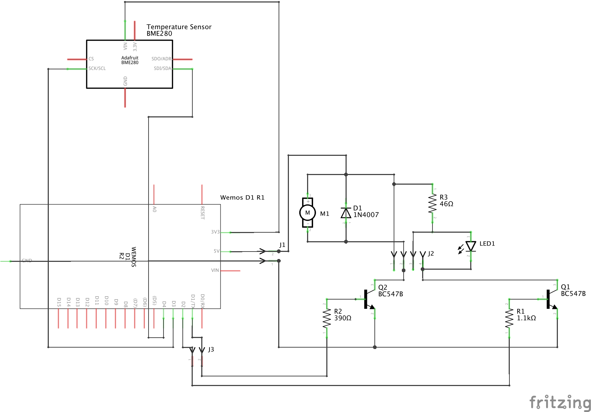

# revolving-blue-light-esp8266
Wiring up an old battery powered revolving blue light with an ESP8266 based Wemos D1 R2. Plus added a BME280 temperature sensor as extra bonus.

## Board View (compact layout)

## Simplified Board View

## Circuit Diagram

## Circuit Diagram with Header Connectors

## Bill of Materials
### Assembly List
|Label|Part Type|Properties|
|--- |--- |--- |
|D1|Diode|Part number 1N4007|
|LED1|LED|10mm; 3.6 V; 30 mA; 80000 mcd|
|M1|DC Motor|
|Q1|NPN-Transistor|Type NPN (CBE); Part number BC547B|
|Q2|NPN-Transistor|Type NPN (CBE); Part number BC547B|
|R1|Resistor|1.1kΩ|
|R2|Resistor|390Ω|
|R3|Resistor|46Ω|
|Temperature Sensor|Sensor|Part number BME280|
|WeMos D1 R1|Microcontroller|[WeMos D1 R1](https://wiki.wemos.cc/products:d1:d1) *("Arduino UNO Compatible wifi board based on ESP8266EX")*|
